# Multitask Shape Classification

## Dataset 

- Split: 9,000 train / 1,000 val, 28×28 binary images, six shape types; counts per image sum to 10. 
- Image example: 

 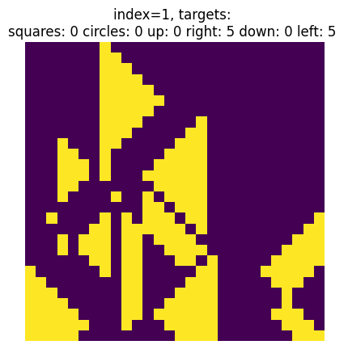 

The images are quite controvertial and sometimes really hard to get correctly (even as a human). I would argue that the labels are not correct a lot of times. 
- Target counts: The counts sum up to 10, and are said to be in 1..9 in the description of the assignment. However, they are actually in the range 2..8, which mean we can reduce the number of classes to 105 instead of 135. In the code, we assume that the counts are from 2 to 8, however this can be easily changed by adjusting to variables in the solution notebook.


- Shape count:

| stat | squares | circles | up | right | down | left |
| --- | ---: | ---: | ---: | ---: | ---: | ---: |
| mean | 1.6574 | 1.7149 | 1.6530 | 1.6770 | 1.6857 | 1.6120 |
| std | 2.6291 | 2.6561 | 2.6196 | 2.6275 | 2.6411 | 2.5750 |
| min | 0.0 | 0.0 | 0.0 | 0.0 | 0.0 | 0.0 |
| p25 | 0.0 | 0.0 | 0.0 | 0.0 | 0.0 | 0.0 |
| median | 0.0 | 0.0 | 0.0 | 0.0 | 0.0 | 0.0 |
| p75 | 3.0 | 3.0 | 3.0 | 3.0 | 3.0 | 3.0 |
| max | 8.0 | 8.0 | 8.0 | 8.0 | 8.0 | 8.0 |

- Configuration distribution: We should verify that all of the classes are (almost) equally represented in the training data: 
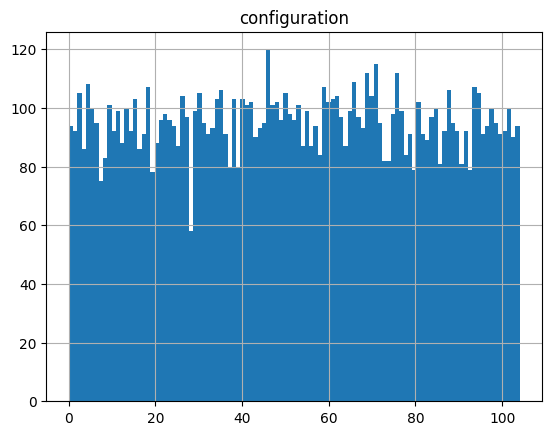

We can see that it is the case for the entire dataset, and assuming that the train/test split was done randomly, it should hold for the train/test subsets as well.

## Model architecture
- Backbone fixed as provided.
- I didn't spend time looking for the best possible architecture for the heads, so they are quite shallow, while allowing to achieve 50% accuracy.
```
        self.head_cls = nn.Sequential(
            nn.Linear(256, 256),
            nn.ReLU(),
            nn.Dropout(p=dropout_p),
            nn.Linear(256, num_classes),
            nn.LogSoftmax(dim=1),
        )

        self.head_cnt = nn.Sequential(
            nn.Linear(256, 128),
            nn.ReLU(),
            nn.Linear(128, num_counts),
        )
```
The reason head_cnt has a smaller dropout probability is that it's already very hard to train and i didn't want it to be significant.

## Data Augmentation
- I've implemented all of the augmentations except for erasement, as it doesn't really make sense in my opinion - the data is already confusing enough for the model. I apply the rotations/flips with a 50% probability, as there is no reason to pick any other probability - rotation/flip doesn't impact performance while increasing the amount of different training samples.
- Contrast/Noise are applied with lower probabilities (30-40%) as they might corrupt the data sometimes, and overtraining wasn't too big of an issue to make me have to increase those. 
- The implementation of those uses predefined torch transformations along with swapping of target counts if flipping/rotating. The user specifies a config and a class that composes many transformations at once is created based on it, then passed to the dataset.

## Experiments
- **Exp A (cls-only)**: λ_cnt=0, classification loss only.
- **Exp B (reg-only)**: λ_cnt=1, classification loss omitted (head still evaluated).
- **Exp B.2 (multitask)**: λ_cnt=1, continue training the model from B but with multitasking
- **Exp C (multitask)**: λ_cnt=1, both losses active (best run).

## Results (validation)

**Experiment summary**

| setting | λ_cnt | cls loss | val loss_total | top-1 acc | macro F1 | RMSE overall | MAE overall |  |
| --- | ---: | --- | ---: | ---: | ---: | ---: | ---: | --- |
| Exp A: cls-only | 0.0 | on | 4.6556 | 0.0110 | 0.0002 | 3.1087 | 1.6667 |  |
| Exp B: reg-only | 1.0 | off | 0.1937 | 0.0110 | 0.0000 | n/a | n/a | |
| Exp B.2: multitask | 1.0 | on | 0.1290 | 0.4950| 0.4414 | 0.5306 |0.2907  | |
| Exp C: multitask | 1.0 | on | 1.5892 | 0.4870 | 0.4548 | 0.6341 | 0.3540 |  |


**Per-shape regression metrics (Exp C, best model)**

| shape | RMSE | MAE |
| --- | ---: | ---: |
| squares | 0.5882 | 0.3178 |
| circles | 0.5983 | 0.3414 |
| triangle up | 0.6473 | 0.3699 |
| triangle right | 0.6758 | 0.3674 |
| triangle down | 0.6049 | 0.3499 |
| triangle left | 0.6901 | 0.3780 |

Worst-paired accuracies (Exp C) remained ≥0.87;

## Visual Results
Learning curves and confusion matrices for each experiment:
- Exp A :(cls-only): 

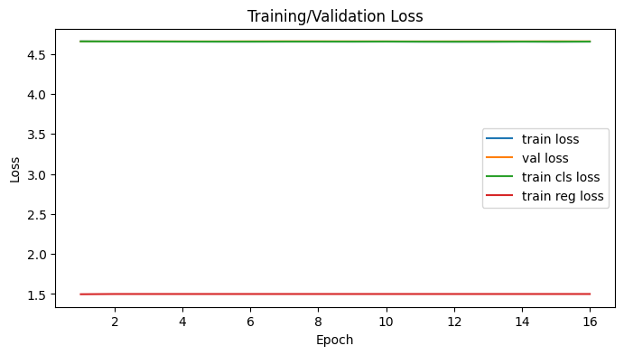 

- Exp B (reg-only): 

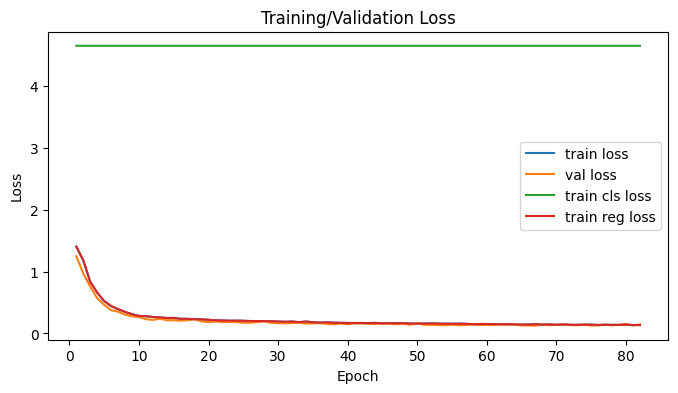 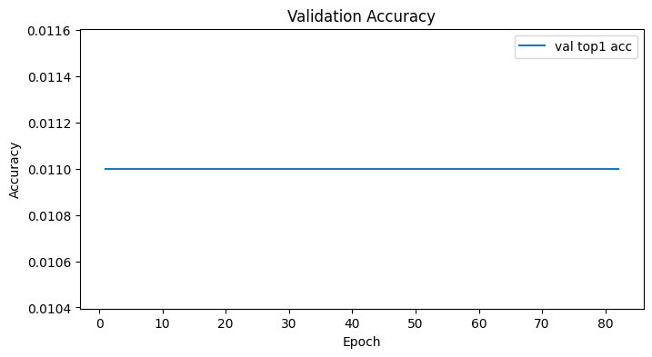 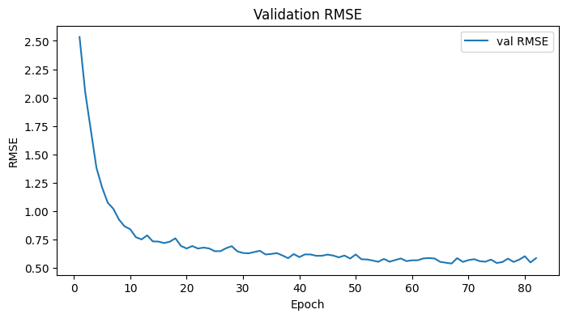 

- Exp B.2 (multitask):

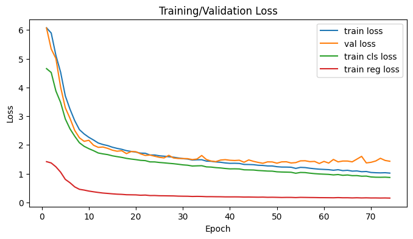 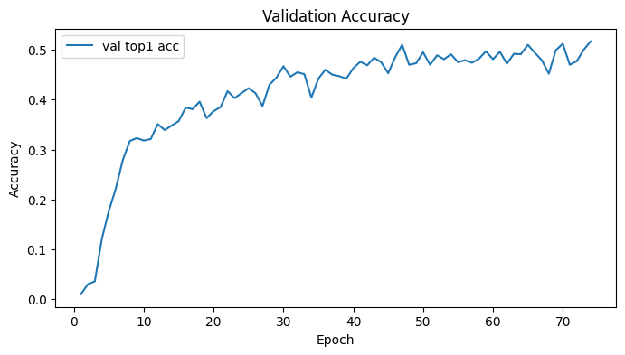 

- Exp C (multitask): 

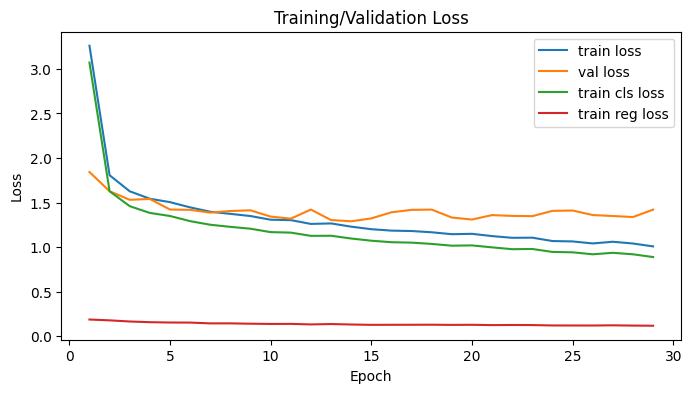 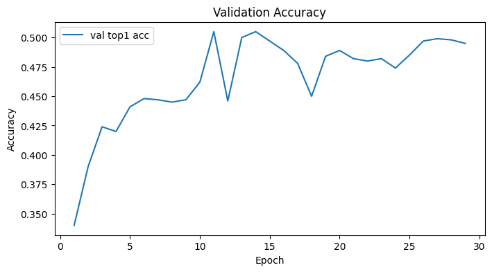 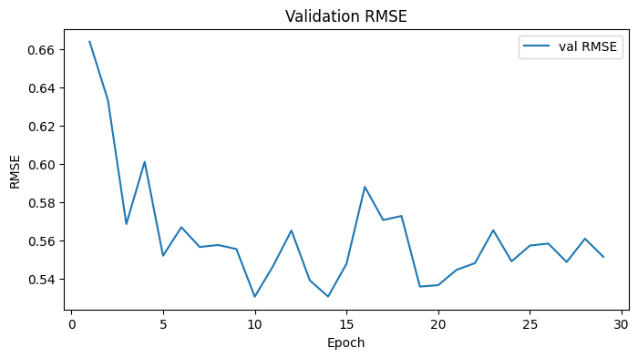 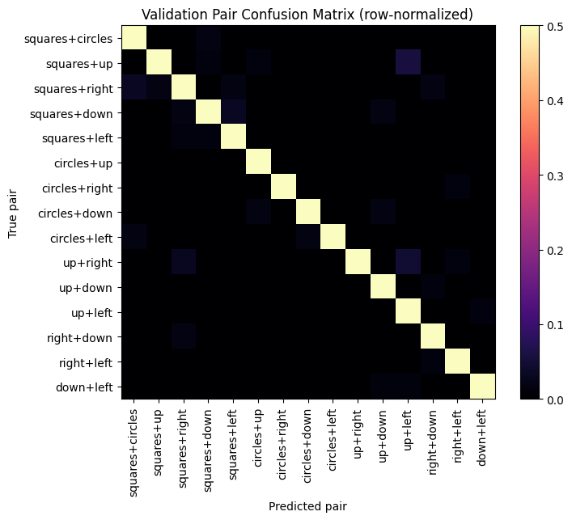


## Discussion
I find the results conclusive: 
- Without multitasking, the model is nearly not training, which is to be expected considering we have >100 binary variables, and our loss does not capture the relationship between those variables: Every class has classes that are extremely similar to itself, like: 5 circles 5 squares and 4 circles 6 squares, etc. In the classification loss we do not account for the fact that the model might be off by one in counting, and still punish the model heavily. We simply can't even start training the model in this setting. 
- The regression works well by itself, and doesn't really need classification. 
- When combined, the regression part allows for much easier training of the classification part.
- The best result was achieved when combining the only-regression loss with the multiclass clasification afterwards. 
- What's interesting is that MRSE stayed above 0.5 the entire time, which would imply that the accuracy gotten from rounding the regression outputs wouldn't be better if not worse than the classification results. 