# HW 2 REPORT

## Part 1: GradCAM

The implementation is pretty straightforward, following the paper. The main trick is to properly record the activations and gradients using the hint from the assignment.
The evaluation and example output were already provided, so I just verified the example output images match those from the template.

Example Grad-CAM visualizations (input, heatmap, overlay, ground-truth mask):

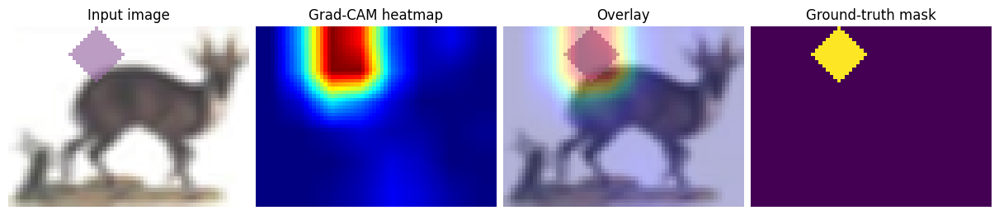
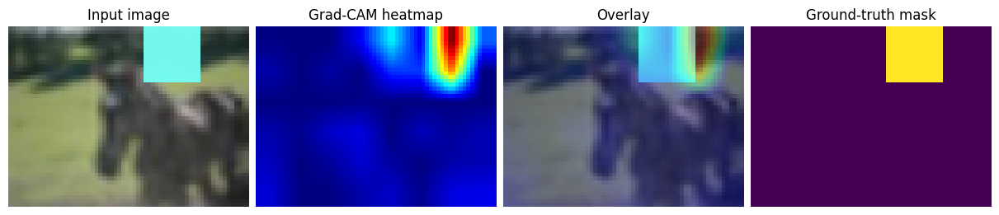
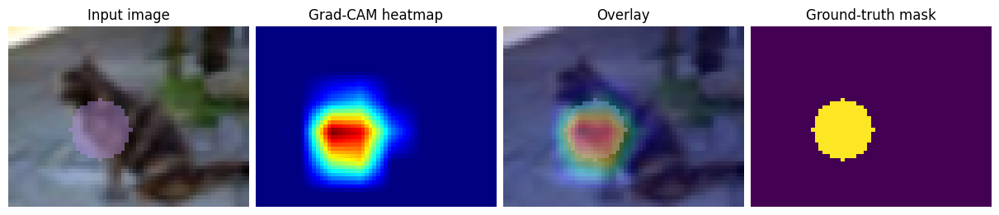

## Part 2: SAM

The goal of the second task is basically: take the heatmap produced by the gradcam, select points that give most info for SAM. 

### First idea
At first, I implemented two most obvious ideas: take n most and least activated points on gradcam. I've evaluated for different counts of points and got the following results 

| Configuration | Mean IoU | FG hit | FG dist (px) | BG hit | BG dist (px) |
|---|---:|---:|---:|---:|---:|
| FG-1 | 71.5% | 67.6% | 6.05 | — | — |
| FG-10 | 75.3% | 69.7% | 5.89 | — | — |
| FG-1 + BG-1 | 70.9% | 67.6% | 6.05 | 98.6% | 32.57 |
| FG-10 + BG-1 | 72.6% | 69.7% | 5.89 | 98.6% | 32.57 |
| FG-10 + BG-10 | 65.1% | 69.7% | 5.89 | 98.8% | 31.89 |

My expectations were that the best result would be when providing lots of foreground and background points at the same time - as this approach seems to be the most informative for the SAM. However, that was not the case. Look at the following examples: 

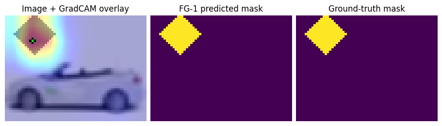
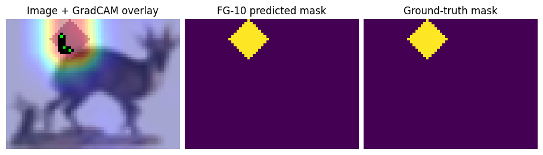
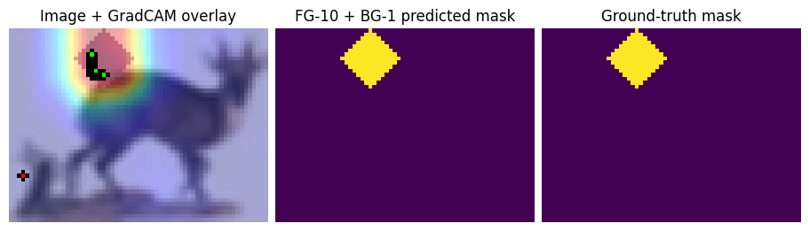
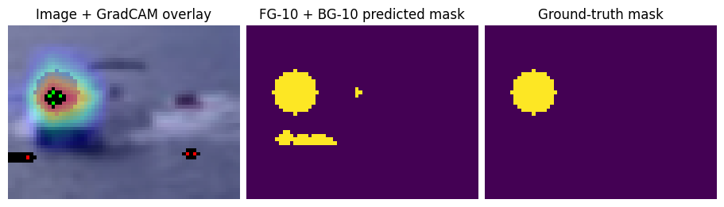
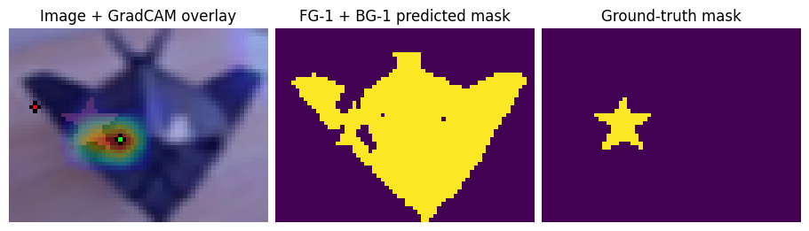

When providing few background points, SAM seems to correctly follow the hints, however as point count increases - SAM isn't following them as well.
For foreground, it seems that providing many clustered points leads to better results. When the green dot actually lands inside the gt mask, we get a correct result most of the time. 

So I decided to keep the foreground approach simple and focus on experimenting with different background point strategies instead. 

### Second Idea 
I thought the problem with background points was that they were very clustered, and somehow spreading them out across the region could help in a situation when the fg points slightly miss the actual shape. To test this, I've changed the background point selection to split the image into multiple regions and select a background point in each of them. The results were: 

| Configuration | Mean IoU | FG hit | FG dist (px) | BG hit | BG dist (px) |
|---|---:|---:|---:|---:|---:|
| FG-1 + BG-grid | 66.3% | 68.8% | 5.94 | 98.9% | 31.46 |

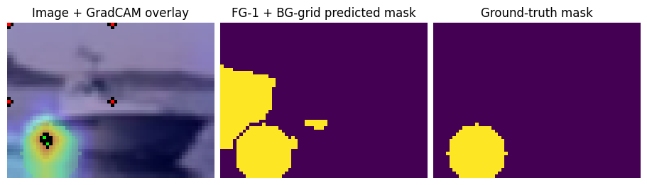
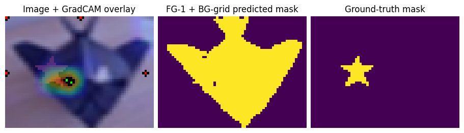

It turned out that this didn't help at all, and when providing too many points SAM just doesnt work, and when providing a few the performance isn't really better still. 
I've decided to try out one more idea.

### Third idea

Maybe spreading the background points evenly around the shape might force the SAM not to select large chunks of the image, which are obviously not what we are looking for. I've implemented this idea with a new subclass, which takes the most activated point in gradcam, and selects points at a certain distance from it as background. Note that this only works in our case, where we know that the shapes are limited in size.
I've got the following results 

| Configuration | Mean IoU | FG hit | FG dist (px) | BG hit | BG dist (px) |
|---|---:|---:|---:|---:|---:|
| FG-5 + BG-ring | 70.0% | 68.8% | 5.94 | 95.9% | 16.00 |

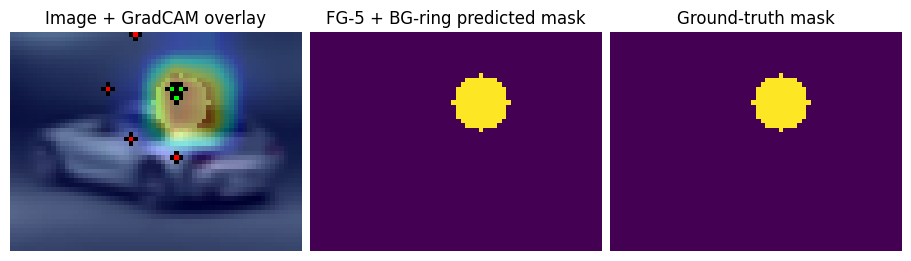
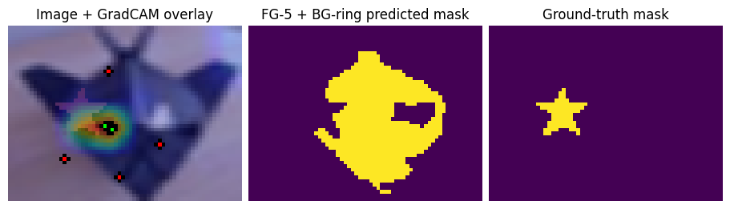

### Points for improvements

There are some other ideas i think it would have been nice to implement. For once, we need to deal with the situation where the most activated point by gradcam is right on the boundary between the shape and the rest of the image. This happens quite often, and we could try either 
1. including fg points all throughout the activated gradcam pixels (i.e. above some threshold), or 
2.  try to take the center of mass of gradcam as the selected point instead.

### Discussion

The main takeaway is that for these simple shapes, SAM mostly just needs to know where the object is (foreground points) and can figure out the boundaries on its own. Adding background points can actually make things worse if they're not placed carefully. The grid approach failed because it placed points too far from the objects, while the ring approach worked better by keeping background points closer to the boundary. Surprisingly, the best performance came from just using multiple foreground points without any background points, which suggests SAM's boundary detection is quite good when given only the foreground region.
