# DQN Exploration Strategies Report

## Overview

The goal here is to compare different ways of balancing exploration in DQN. In the report I will go over each of the strategies, shortly explain how they work and/or how the parameters of interest influence the outcome. At the end, I will try to compare the methods and give my impression of which looks best.

## Methods

For each of the methods, I will present a chart of it's learning curve, as well as a chart with different learning curves depending on the parameter of interest.
Note: the sensitivity analysis was done with less steps, as it takes too much time to run with full setting, simply not enough colab compute time. Because of this, some conclusions about best hyperparameters might not be correct - sorry!

### 1. epsilon-greedy

With probability epsilon take a random action, otherwise take the most likely action. Simple and effective enough for training - the main tradeoff is that random actions are completely uninformed, which can waste steps on obviously bad choices.

**Training Results**
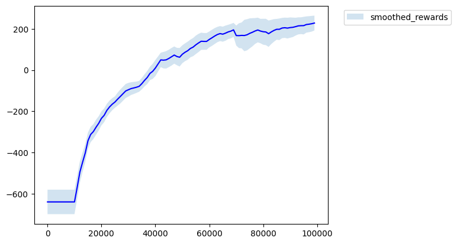

**Sensitivity Analysis**
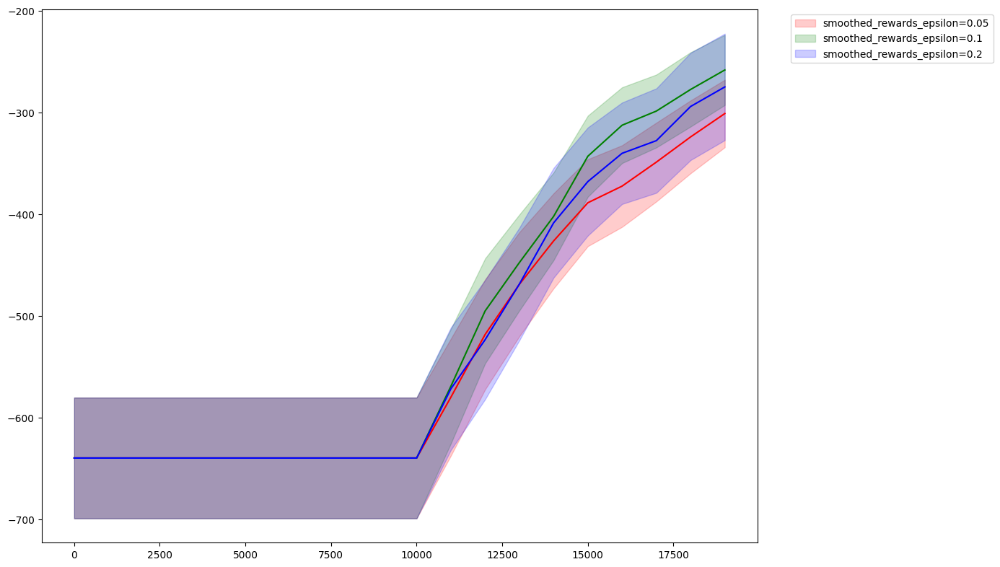

Epsilon of 0.5 and 1 make most sense here - the model isn't that complex, so we don't need tons of exploration once we have decent estimates. Going too high is worse probably because we're wasting too many steps on random actions when we already know what to do. Overall this method has decent mean but relatively high variance.

### 2. epsilon-greedy with annealing

Since early estimates are garbage anyway, it makes sense to start with high exploration and decay over time. This is the same strategy as before, but we set epsilon as high in the beginning and lower it over time.

**Training Results**
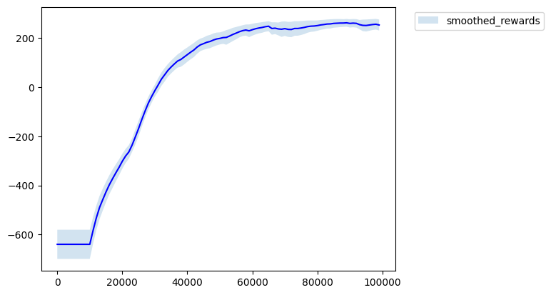

**Sensitivity Analysis**
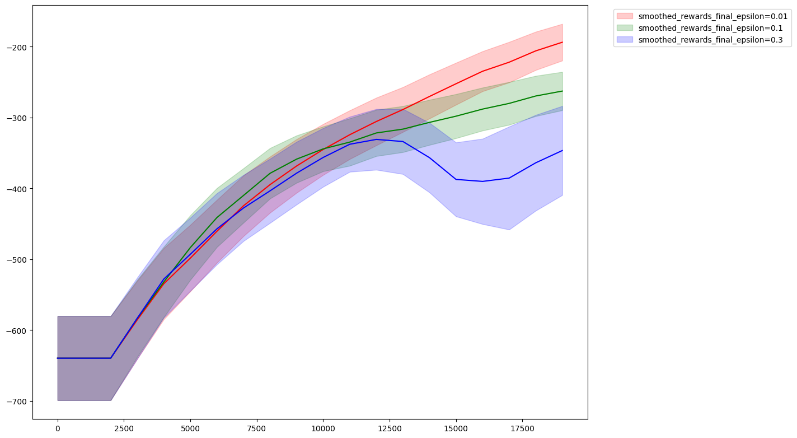

Lower epsilon works best here once again, it shows that even in the beginning of training (because the total is 100k steps, and here we only show 20k) the model already knows pretty well what to do, so decreasing random steps is optimal. This strategy also outperform the pure epsilon greedy, meaning decreasing epsilon even further is beneficial.

### 3. boltzmann

Instead of purely random exploration, sample actions proportionally to their q values, scaled by temperature. Here the most confusing thing for me was the fact that we need to multiply by t, not divide. Higher temperature means sharper distribution (more greedy), lower means more uniform.

**Training Results**
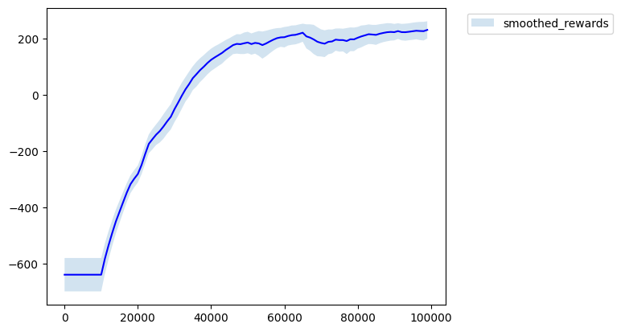

**Sensitivity Analysis**
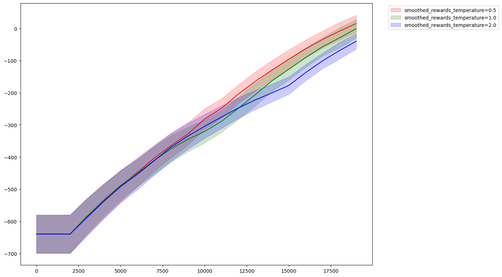

Here the results are kind of inconclusive as the spread is kind of small, all values are kind of okay - this can be expected since we don't make truly random actions to waste our time anymore. Surprisingly, doesnt outperform the epsilon greedy strategy by much, although thats something i would expect. 

### 4. boltzmann with temperature annealing

Start with low temperature and increase over time to get more greedy as training progresses. We expect an improvement for the same reason as with epsilon greedy strategy.

**Training Results**
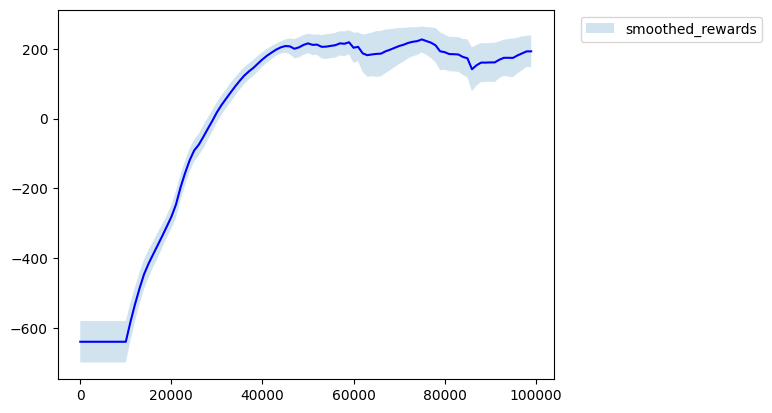

**Sensitivity Analysis**
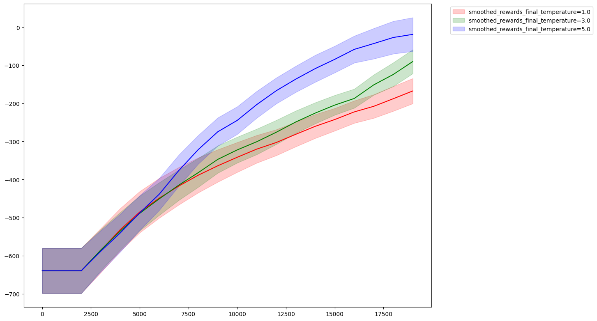

Higher temperature, same as lower epsilon works better in this case as well. The  method seems unstable - has big swings especially around 60k-80k steps. The annealing schedule might be poorly tuned, but I'm not sure.

### 5. max-boltzmann

A hybrid - usually act greedy, but with epsilon probability use boltzmann sampling instead of uniform random. This seems smart, although i am not too sure why it performs as well as it does. 

**Training Results**
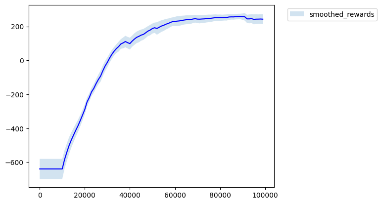

**Sensitivity Analysis**
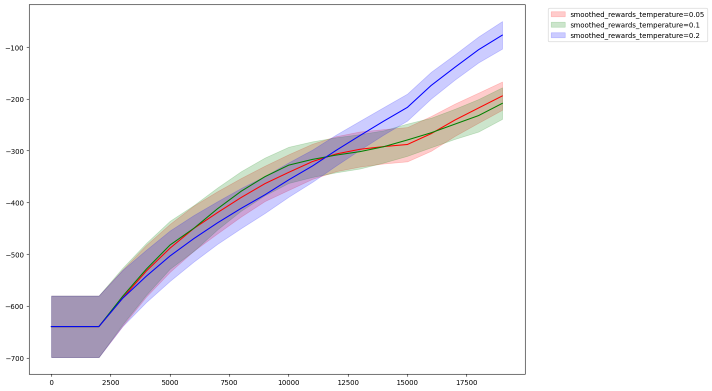

Same result as for previous strategies with boltzmann. This strategy reaches the top tier quickly and stays stable.

### 6. max-boltzmann with temperature annealing

Both epsilon and temperature change over time. More hyperparameters to tweak. It seems like annealing strategy is generally better than a non-annealing strategy, so I can see how this might be a good approach.

**Training Results**
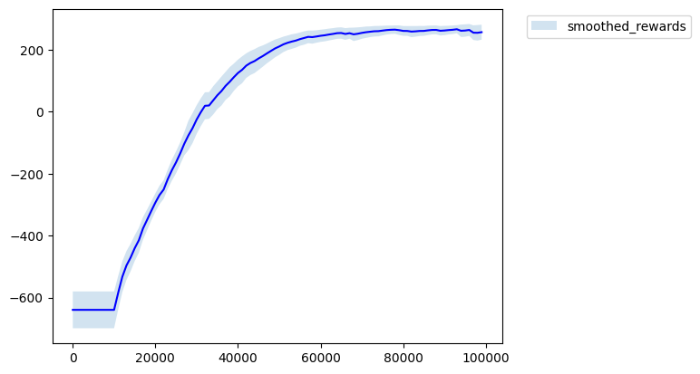

**Sensitivity Analysis**
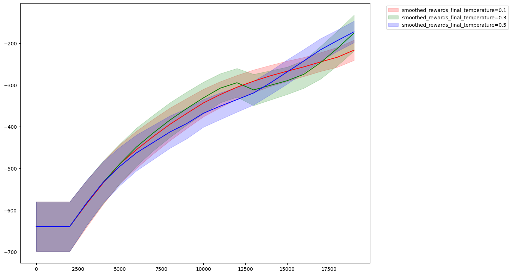

This is the clear winner with highest reward and lowest variance. The dual annealing of both epsilon and temperature gives the best results which further implies that annieling is the way to go

### 7. half epsilon-greedy, half boltzmann

First half uses epsilon-greedy with annealing to get decent Q-estimates, then switches to boltzmann for the second half. 

**Training Results**
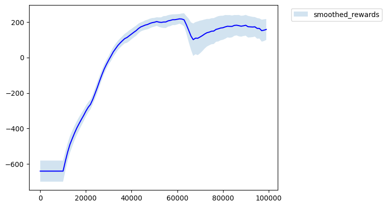

**Sensitivity Analysis**
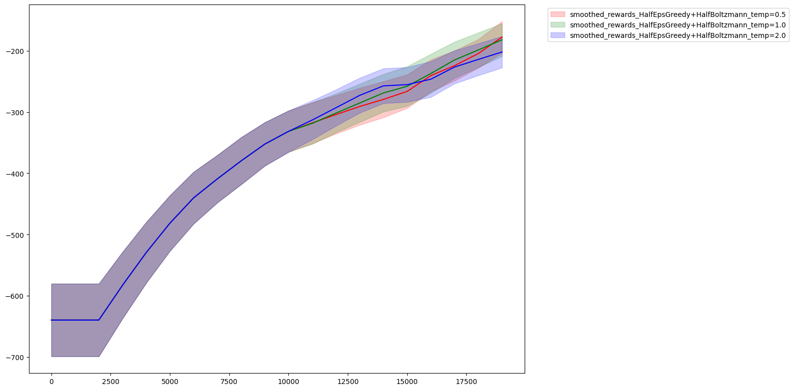

The strategy looked promising but ended up to be middle of the pack. The orange line in the comparison chart shows some instability - there's variance around the transition point at 50k steps. Maybe a gradual blend would work better than a hard switch of strategies.

### 8. adaptive boltzmann

The idea here is to automatically adjust the effective temperature based on how confident we are in our estimates. We measure confidence as the gap between two most likely actions - the difference between the top two q values. When there's a clear winner , we increase the temperature to act more greedily. When Q-values are similar , we explore more since we're uncertain.

The effective temperature is computed as: `effective_temp = base_temp * clamp(alpha * gap, min_effect, max_effect)`
where `alpha, min_effect and mass_efect` are hyperparameters.

**Training Results**
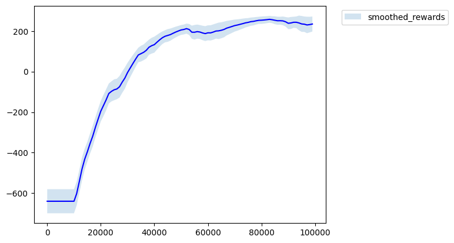

**Sensitivity Analysis**
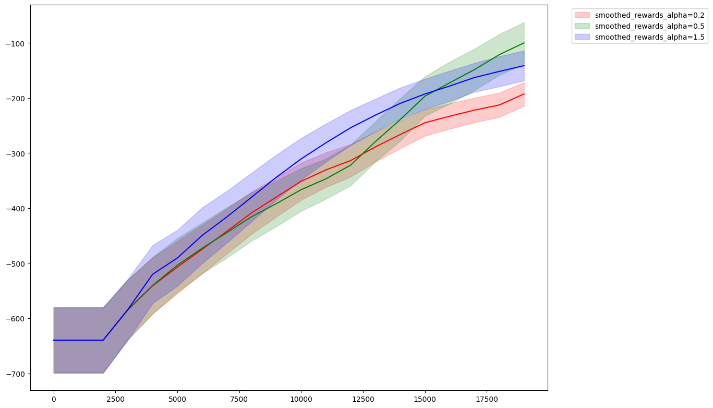

The strategy overall looks promising -  performers well with very low variance.  Though I think I could've done a better job of analyzing it with different parameters.

---

## Comparison

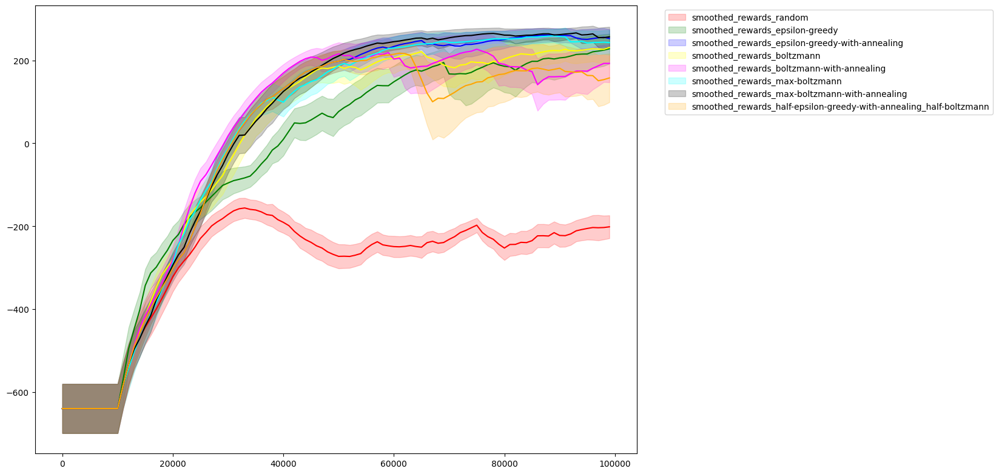

Summary of all methods:

| Method | Final Mean | Final Std |
|--------|------------|-----------|
| random | -206.59 | 17.03 |
| epsilon-greedy | 216.63 | 43.24 |
| epsilon-greedy-with-annealing | 262.75 | 16.27 |
| boltzmann | 207.24 | 33.46 |
| boltzmann-with-annealing | 198.51 | 58.47 |
| max-boltzmann | 269.04 | 16.83 |
| max-boltzmann-with-annealing | 277.95 | 9.29 |
| half-epsilon-greedy-with-annealing_half-boltzmann | 239.79 | 25.78 |
| boltzman-with-adaptive | 267.27 | 10.46 |

---

## Conclusions

**What worked:**
- max-boltzmann with temperature annealing is the clear winner - best mean and lowest variance
- max-boltzmann and adaptive boltzmann also perform very well with low variance
- epsilon-greedy with annealing beats plain epsilon-greedy significantly

**What didn't work:**
- pure random exploration completely fails (no surprise)
- boltzmann with temperature annealing is surprisingly unstable with wild swings
- hard switching between strategies causes instability at the transition point, and at the end leads to worse accuracy(reward)

**Surprises:**
- most times higher temperature/lower epsilon caused better results, although I'd expect the opposite

**Takeaway:** The hybrid approaches win here. Max-boltzmann with temperature annealing gives the best results, closely followed by plain max-boltzmann and the adaptive approach. Epsilon-greedy with annealing is a solid choice still, while being the least complex. 
